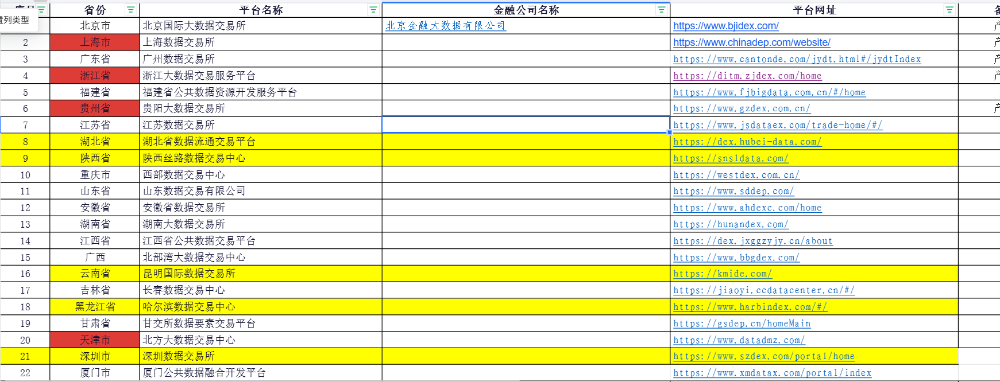
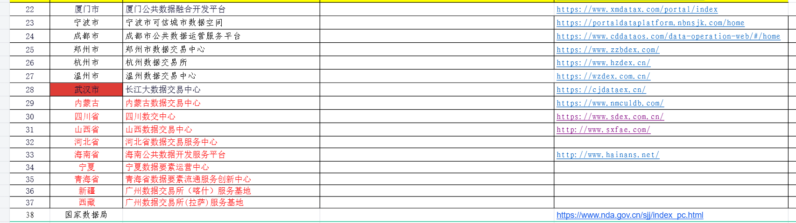

# 数据平台来源清单与网址探测记录

本文档记录两张来源截图中的 38 条平台记录，以及 2026-07-10 在 `Asia/Shanghai` 时区下执行的轻量 HTTP 探测结果。机器可读配置见 [`../config/platforms.csv`](../config/platforms.csv)。

## 来源截图

截图按原始 PNG 字节复制到仓库，不做裁剪、转码或覆盖：

## 转录与规范化约定

- `source_url` 严格保留截图中的网址，包括 `http`/`https`、路径和 hash 路由。
- 只有上海数据交易所的两次 308 重定向完整到达 HTTP 200，因此其 `canonical_url` 规范化为 `https://www.chinadep.com/`。
- 江苏和陕西入口虽曾返回重定向，但目标站未完成连通验证，因此不替换 `canonical_url`。
- 宁波和武汉仅在忽略证书校验后得到诊断性响应；这些响应不能作为正式入口，也没有用于替换 `canonical_url`。
- 截图只有一个“省份”列且混有市级项。CSV 将明确的市级项补齐所属省，并在 `notes` 保留截图区域；平台名称明确包含城市时，将该城市提取到 `city`。截图中的自治区简称保持原文。
- 第 38 行“国家数据局”位于截图的省份列，平台名称单元格为空；CSV 按该列位置原样保留。
- 有网址的 33 条记录均设为 `enabled=true`，便于定时健康检查发现恢复；5 条无网址记录设为 `enabled=false`。当前不可达不等于永久失效。
- `render_mode=auto` 和 `adapter=generic` 是初始安全值；完成页面结构勘探后可为单站切换浏览器渲染或专用适配器。

## 探测方法

探测分两轮完成，目标是读取响应头和重定向信息，不进行页面内容批量下载：

1. 首轮使用 Python `requests 2.32.5`，浏览器样式 User-Agent、GET 流式响应、自动跟随重定向，连接超时 6 秒、读取超时 15 秒。
2. 对首轮超时、TLS 错误、断开和 403 项，使用 Windows `curl.exe` 发送 HEAD 请求复核，连接超时 7 秒、总超时 18 秒，并跟随重定向。
3. 对证书主机名不匹配或证书过期的站点，只额外执行一次忽略校验的诊断探测；诊断结果不会改写官方入口。
4. hash 片段（`#...`）不会发送给服务器，因此状态码只代表其服务端入口；后续仍需浏览器渲染验证前端路由和数据接口。

状态反映本次网络环境中的即时结果。超时可能来自线路、IP 白名单、WAF、限流或 TLS 策略，不能单凭一次探测判定官网永久下线。

## 逐站清单

| ID | 省/区域 | 城市 | 平台名称 | 截图网址 | 本次结果 |
|---:|---|---|---|---|---|
| 1 | 北京市 | 北京市 | 北京国际大数据交易所 | `https://www.bjidex.com/` | HTTP 200 |
| 2 | 上海市 | 上海市 | 上海数据交易所 | `https://www.chinadep.com/website/` | 308 × 2 → HTTP 200；最终 `https://www.chinadep.com/` |
| 3 | 广东省 | 广州市 | 广州数据交易所 | `https://www.cantonde.com/jydt.html#/jydtIndex` | 远端断开；复核超时 |
| 4 | 浙江省 | — | 浙江大数据交易服务平台 | `https://ditm.zjdex.com/home` | HTTP 200 |
| 5 | 福建省 | — | 福建省公共数据资源开发服务平台 | `https://www.fjbigdata.com.cn/#/home` | 连接超时 |
| 6 | 贵州省 | 贵阳市 | 贵阳大数据交易所 | `https://www.gzdex.com.cn/` | 连接超时 |
| 7 | 江苏省 | — | 江苏数据交易所 | `https://www.jsdataex.com/trade-home/#/` | 302 → `https://exchange.jsdataex.com/trade-home/`；目标超时 |
| 8 | 湖北省 | — | 湖北省数据流通交易平台 | `https://dex.hubei-data.com/` | HTTP 200 |
| 9 | 陕西省 | — | 陕西丝路数据交易中心 | `https://snsldata.com/` | 曾 301 → `https://www.snsldata.com/`；目标超时且结果不稳定 |
| 10 | 重庆市 | 重庆市 | 西部数据交易中心 | `https://westdex.com.cn/` | HTTP 403；服务可达但拒绝当前客户端 |
| 11 | 山东省 | — | 山东数据交易有限公司 | `https://www.sddep.com/` | HTTP 200 |
| 12 | 安徽省 | — | 安徽省数据交易所 | `https://www.ahdexc.com/home` | HTTP 200 |
| 13 | 湖南省 | — | 湖南大数据交易所 | `https://hunandex.com/` | HTTP 200 |
| 14 | 江西省 | — | 江西省公共数据交易平台 | `https://dex.jxggzyjy.cn/about` | 连接超时 |
| 15 | 广西 | — | 北部湾大数据交易中心 | `https://www.bbgdex.com/` | HTTP 200 |
| 16 | 云南省 | 昆明市 | 昆明国际数据交易所 | `https://kmide.com/` | HTTP 200 |
| 17 | 吉林省 | 长春市 | 长春数据交易中心 | `https://jiaoyi.ccdatacenter.cn/#/` | TLS EOF；复核连接超时 |
| 18 | 黑龙江省 | 哈尔滨市 | 哈尔滨数据交易中心 | `https://www.harbindex.com/#/` | HTTP 200 |
| 19 | 甘肃省 | — | 甘交所数据要素交易平台 | `https://gsdep.cn/homeMain` | TLS EOF；复核连接超时 |
| 20 | 天津市 | 天津市 | 北方大数据交易中心 | `https://www.datadmz.com/` | HTTP 200 |
| 21 | 广东省 | 深圳市 | 深圳数据交易所 | `https://www.szdex.com/portal/home` | HTTP 200 |
| 22 | 福建省 | 厦门市 | 厦门公共数据融合开发平台 | `https://www.xmdatax.com/portal/index` | TLS EOF；复核连接超时 |
| 23 | 浙江省 | 宁波市 | 宁波市可信城市数据空间 | `https://portaldataplatform.nbnsjk.com/home` | 证书主机名不匹配；仅忽略校验后 HTTP 200 |
| 24 | 四川省 | 成都市 | 成都市公共数据运营服务平台 | `https://www.cddataos.com/data-operation-web/#/home` | HTTP 200 |
| 25 | 河南省 | 郑州市 | 郑州市数据交易中心 | `https://www.zzbdex.com/` | HTTP 200 |
| 26 | 浙江省 | 杭州市 | 杭州数据交易所 | `https://www.hzdex.cn/` | HTTP 200 |
| 27 | 浙江省 | 温州市 | 温州数据交易中心 | `https://wzdex.com.cn/` | Windows Schannel HTTP 200；Python/OpenSSL 判为自签名证书 |
| 28 | 湖北省 | 武汉市 | 长江大数据交易中心 | `https://cjdataex.cn/` | 证书过期；忽略校验后转到 `/Common/SiteExpired` |
| 29 | 内蒙古 | — | 内蒙古数据交易中心 | `https://www.nmculdb.com/` | HTTP 200 |
| 30 | 四川省 | — | 四川数字中心 | `https://www.sdex.com.cn/` | 连接超时 |
| 31 | 山西省 | — | 山西数据交易中心 | `http://www.sxfae.com/` | 空响应／远端主动断开 |
| 32 | 河北省 | — | 河北省数据交易服务中心 | — | 截图未提供网址 |
| 33 | 海南省 | — | 海南公共数据开发服务平台 | `http://www.hainans.net/` | HTTP 200 |
| 34 | 宁夏 | — | 宁夏数据要素运营中心 | — | 截图未提供网址 |
| 35 | 青海省 | — | 青海数据要素流通服务创新中心 | — | 截图未提供网址 |
| 36 | 新疆 | 喀什 | 广州数据交易所（喀什）服务基地 | — | 截图未提供网址 |
| 37 | 西藏 | 拉萨市 | 广州数据交易所（拉萨）服务基地 | — | 截图未提供网址 |
| 38 | 国家数据局 | — | — | `https://www.nda.gov.cn/sjj/index_pc.html` | HTTP 200 |

## 汇总与异常优先级

- 18 个网址正常返回 HTTP 200，包括上海站完成重定向后的结果。
- 1 个网址返回 HTTP 403，证明服务可达但存在访问控制。
- 2 个入口能返回重定向，但重定向目标超时。
- 3 个站点存在明确证书或 TLS 信任差异：宁波、温州、武汉。
- 9 个站点在本次环境中超时、断开或无响应：ID 3、5、6、14、17、19、22、30、31。
- 5 条记录在截图中没有网址：ID 32、34、35、36、37。
- 武汉站（ID 28）同时出现证书过期和 `SiteExpired` 页面，是最高优先级人工核验项。
- 宁波站（ID 23）的证书主机名不匹配，生产爬虫不应全局关闭 TLS 校验；应等待官网修复或确认新的官方域名。
- 温州站（ID 27）在 Windows 与 OpenSSL 信任库之间结果不一致，部署到 Linux 后应再次验证证书链。
